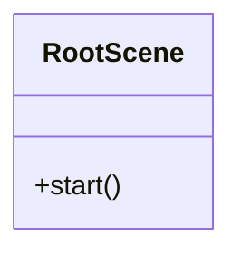
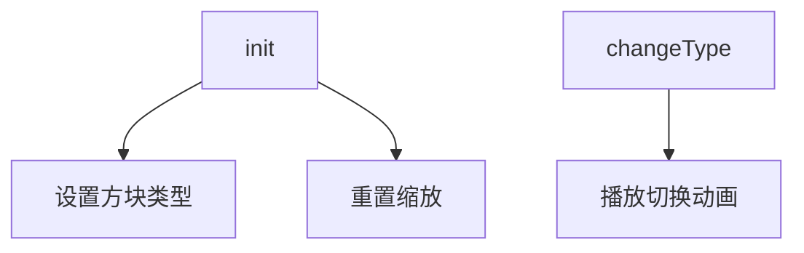
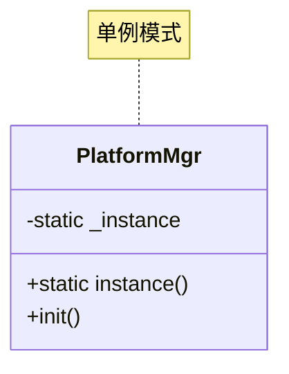
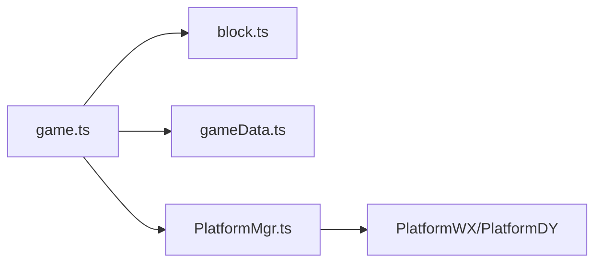

# Cocos Creator 游戏代码分析报告

## 1. 项目概述
本项目是一个基于 Cocos Creator 的消除类游戏，主要功能包括：
- 方块生成与消除
- 多关卡设计
- 平台适配（微信、抖音）
- 广告与分享功能

## 2. 核心文件分析

### 2.1 RootScene.ts
#### 功能
- 场景基类，处理分辨率适配

#### 关键代码
```typescript
start() {
  if (!EDITOR) {
    cc.view.setResolutionPolicy(cc.ResolutionPolicy.SHOW_ALL);
    // 动态添加Mask组件确保UI适配
  }
}
```

#### 类图


---

### 2.2 block.ts
#### 功能
- 管理方块状态和动画

#### 属性
| 属性 | 类型 | 说明 |
|------|------|------|
| maskNode | Node | 触摸遮罩 |
| spriteFrames | SpriteFrame[] | 方块贴图资源 |

#### 方法


---

### 2.3 gameData.ts
#### 数据结构
```json
{
  "level": 1,
  "layerNum": 1,
  "typeNum": 5,
  "positions": [{"x":-160, "y":267.5}, ...]
}
```

#### 处理流程
1. 加载30个关卡数据
2. 校验方块数量为3的倍数
3. 填充缺失位置

---

### 2.4 PlatformMgr.ts
#### 平台功能
| 方法 | 说明 |
|------|------|
| showShare() | 触发分享 |
| showVideoAd() | 播放激励视频 |
| showInterstitialAd() | 显示插屏广告 |

#### 设计模式


## 3. 资源管理

### 3.1 资源清单
| 类型 | 路径 | 使用场景 |
|------|------|----------|
| SpriteFrame | block.ts | 方块贴图 |
| AudioClip | game.ts | 音效播放 |

### 3.2 释放建议
- 场景切换时调用`release()`释放纹理资源
- 广告资源使用后立即销毁

## 4. 架构设计

### 4.1 模块关系


### 4.2 优化建议
1. 使用对象池管理方块节点
2. 异步加载关卡资源
3. 添加资源引用计数

## 5. 待办事项
- [ ] 补充微信平台测试用例
- [ ] 增加资源释放检测
- [ ] 实现多语言支持