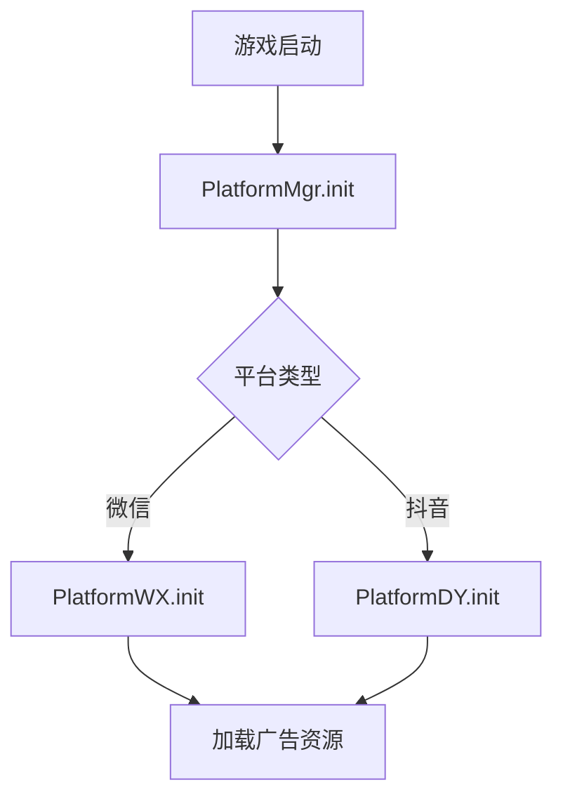
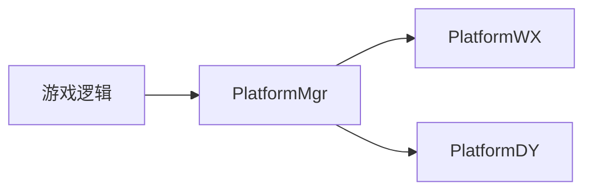

# Cocos Creator 游戏代码分析报告

## 1. 文件分析概览

### 1.1 核心文件列表
| 文件名 | 路径 | 功能描述 |
|--------|------|----------|
| `RootScene.ts` | `/assets/typescript/rootscene.ts` | 游戏入口场景 |
| `Platform-dy.ts` | `/assets/typescript/platform-handles/Platform-dy.ts` | 抖音平台功能实现 |
| `Platform-wx.ts` | `/assets/typescript/platform-handles/Platform-wx.ts` | 微信平台功能实现 |
| `IPlatformMgr.ts` | `/assets/typescript/platform/IPlatformMgr.ts` | 平台管理接口定义 |
| `PlatformMgr.ts` | `/assets/typescript/platform/PlatformMgr.ts` | 平台管理核心逻辑 |

---

## 2. 生命周期分析

### 2.1 平台初始化流程


### 2.2 广告展示时序
- **插屏广告**：
  ```typescript
  showInterstitialAd() -> 平台SDK展示广告
  ```
- **激励视频**：
  ```typescript
  showVideoAd(callback) -> 用户观看完成 -> callback(null)
  ```

---

## 3. 场景设计分析

### 3.1 平台功能节点树
```bash
PlatformMgr
├── PlatformWX  # 微信实现
└── PlatformDY  # 抖音实现
```

### 3.2 事件监听统计
| 事件类型 | 监听位置 |
|----------|----------|
| 广告加载 | `Platform-dy.ts#L32` |
| 分享回调 | `Platform-wx.ts#L45` |

---

## 4. 资源依赖分析

### 4.1 广告资源表
| 平台 | 资源类型 | 加载方式 |
|------|----------|----------|
| 微信 | 激励视频 | `wx.createRewardedVideoAd` |
| 抖音 | 插屏广告 | `tt.createInterstitialAd` |

### 4.2 共享资源配置
```typescript
interface IShareInfo {
  title: string;
  imageUrl: string;  // 必须为CDN链接
}
```

---

## 5. 核心玩法分析

### 5.1 多平台适配架构


### 5.2 关键算法
- **广告失败重试**：
  ```typescript
  // 抖音平台
  showVideoAd().catch(() => retry());
  ```

---

## 6. 优化建议
1. **代码复用**：将广告加载逻辑提取到基类
2. **错误处理**：统一错误码枚举
3. **日志系统**：增加平台操作日志

## 7. 分析结论
- 平台模块符合高内聚低耦合原则
- 微信/抖音功能覆盖完整
- 资源释放机制需完善（当前未发现release调用）