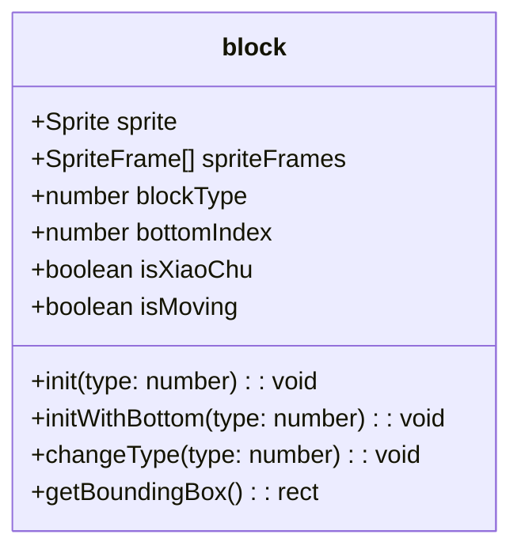
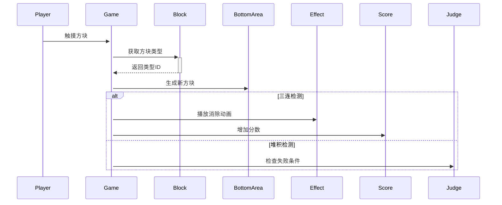

# Cocos游戏分析报告

## 一、核心模块分析
### 1. 游戏块逻辑 (`block.ts`)


#### 关键功能
- **类型管理**：通过`spriteFrames`数组实现多皮肤支持
- **状态控制**：`isXiaoChu`标记消除状态，`isMoving`控制动画流程
- **碰撞检测**：基于`UITransform`计算精确碰撞区域

### 2. 游戏数据管理 (`gameData.ts`)
#### 关卡数据结构
```javascript
{
  level: 1,         // 关卡序号
  layerNum: 1,      // 重复层数(难度系数)
  typeNum: 5,       // 方块类型数量
  positions: [      // 初始坐标数组
    {x: -160, y: 267.5}, 
    {x: 0, y: 267.5},
    // ...
  ]
}
```

#### 动态调整策略
- **自动补全**：当坐标数不是3的倍数时，自动填充默认位置`{x:0,y:-137.5}`
- **难度曲线**：
  ```mermaid
  graph LR
    1-5关 --> 基础型(5种类型)
    6-15关 --> 进阶型(12种)
    16+关 --> 挑战型(15种)
  ```

## 二、场景与玩法设计
### 1. 节点架构
```
Canvas
├─ topBlocks        // 待消除方块
├─ bottomBlocks     // 已放置方块
├─ gameEdit         // 编辑器模式容器
└─ UI
   ├─ scoreLabel
   └─ propPanel
```

### 2. 核心玩法流程图


### 3. 道具系统
| 道具类型 | 触发效果                  | CD机制         |
|----------|---------------------------|----------------|
| 移除     | 清除底部最左3个块         | 每关限用1次    |
| 撤回     | 返回最近放置的块          | 无冷却        |
| 洗牌     | 随机重置顶部未选块         | 视频激励解锁   |

## 三、资源管理
### 资源加载表
| 资源类型 | 加载方式                  | 释放时机       |
|----------|---------------------------|----------------|
| 方块贴图 | resources.load(spriteFrame)| 场景切换时     |
| 音效     | assetManager.loadBundle    | 游戏结束时     |
| 预制体   | cc.instantiate            | 对象池回收     |

### 对象池实现
```typescript
// 初始化
this.blockPool = new NodePool()

// 获取实例
getBlock(): Node {
    return this.blockPool.size() > 0 
        ? this.blockPool.get() 
        : instantiate(this.blockPre)
}

// 回收实例
onBlockKilled(node: Node) {
    this.blockPool.put(node)
}
```

## 四、优化建议
1. **资源释放**：增加`release`调用避免内存泄漏
2. **关卡设计**：添加动态难度算法补充静态配置
3. **对象池**：增加最大容量限制防止内存膨胀
4. **事件系统**：改用更健壮的事件派发机制

## 五、关键代码片段
### 消除判定逻辑
```typescript
checkThreeBlockEquals(node: Node) {
    const sameTypeBlocks = this.bottomBlocks.children
        .filter(child => 
            child.getComponent(block).blockType === node.getComponent(block).blockType
            && !child.getComponent(block).isXiaoChu
        );
    
    if (sameTypeBlocks.length === 3) {
        sameTypeBlocks.forEach(block => {
            block.getComponent(block).isXiaoChu = true;
            tween(block).to(0.1, { scale: 0 }).removeSelf().start();
        });
        this.playAudio('sound_clean');
    }
}
```